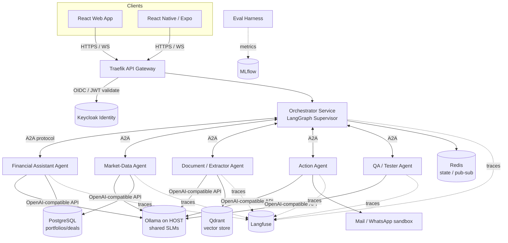

# Agentic Mesh for Wealth Management — Implementation Plan

> **Project (sujet de stage):** A *fleet of AI agents* ("Agentic Mesh" / Swarm) for the
> private-banking / wealth-management domain, fronted by a conversational financial
> assistant inspired by **Mermaid**. Each agent is an independently deployable
> **microservice**, orchestrated with **LangGraph**, communicating via an **A2A**
> protocol, behind a **Traefik API gateway + Keycloak identity**, running on
> **Kubernetes (minikube)**, powered entirely by **free, local Small Language Models**.
>
> One API-first backend serves **both** the React web app and the React Native (Expo)
> mobile app at the same time.

---

## 0. How this maps to the mentor's brief

| Mentor / whiteboard signal | Where it lives in this plan |
|---|---|
| "fleet d'agents : Agentic Mesh" / "SWARM Agentic" | Multi-agent mesh (Phases 5–10), orchestrator + 5 agents |
| "un agent = un microservice", parallel, communication protocols | Microservices + **A2A** protocol (Phase 2, 5), Kubernetes (Phase 15) |
| "modèles américain / chinois / français", "SLM" (circled), Phi-4, DeepSeek 14B, Qwen, Mistral | Local SLM roster on Ollama (Phase 1) |
| "agent contexte 5.5 / raisonnement" | Reasoning model (DeepSeek-R1-Distill) used selectively (Phase 1, 5) |
| "agent financier = agent conversationnel" (Mermaid) | **Financial Assistant agent** (Phase 6) |
| "agent extracteur" / "documentaliste" / Extraction / DOM | **Document/Extractor agent (RAG)** (Phase 8) |
| "API financiers / informations économiques / valeurs numériques" | **Market-Data agent** (Phase 7) |
| "actions e-mails, messages WhatsApp, actions financières" | **Action agent** (Phase 9) |
| "testeur fonctionnel / génère le code pour tester / AI-SDLC" | **QA / Tester agent** (Phase 10) |
| "Callbot: voice-to-voice / voice-to-text / text-to-text" | Voice layer: Whisper STT + Piper TTS (Phase 11) |
| "métriques pour évaluer les sorties", feedback loop (transfer-function analogy) | **Evaluation layer**: Langfuse + MLflow + LLM-as-judge (Phase 12) |
| LangChain / LangGraph | Agent framework (Phase 2, 5) |
| Trace AI / Laminar AI / MLflow | Observability + experiment tracking (Phase 12) |
| "API gateway + Identity" | **Traefik + Keycloak** (Phase 4) |
| "images / mini cube K8s" | Docker + **Kubernetes (minikube)** (Phase 15) |
| AI Act / RGPD / GDPR, "c'est confidentiel" | Local-only data + compliance hardening (Phase 16) |
| Web app simulating a financial system (~30 screens) | React web app (Phase 13) |

---

## 1. Hardware budget & golden rules (RTX 2050, 16 GB RAM)

The **RTX 2050 laptop GPU has only 4 GB VRAM**. This is the single most important
constraint. Every decision below respects it.

**Golden rules — do not violate these:**

1. **One LLM in VRAM at a time.** Ollama loads/swaps models on demand. Never run two
   7B models concurrently. Prefer 3B-class models for routing/most agents; reserve one
   7B (Q4) for the main conversational agent.
2. **Ollama runs on the HOST, not inside Kubernetes.** minikube GPU passthrough on
   Windows is unreliable; running Ollama natively on Windows (or WSL2) lets it use CUDA
   directly. All containerized agents reach it via `http://host.docker.internal:11434`
   (or the minikube host gateway). **All agents share this one Ollama server.**
3. **Two run profiles:**
   - **`dev` (daily work):** docker-compose with only the services you're touching +
     host Ollama. Light on RAM.
   - **`full` (demo/validation):** minikube with the whole mesh, resource limits on
     every pod.
4. **Quantize everything:** GGUF `Q4_K_M` for LLMs, `int8` for Whisper, CPU for TTS.
5. **Budget the 16 GB RAM:** minikube full stack (Keycloak, Traefik, Postgres, Qdrant,
   Redis, agents, Langfuse) is heavy. Set pod memory limits; stop services you aren't
   demoing. Keycloak + Postgres + Qdrant alone ≈ 2–3 GB.

**VRAM/role-aware model roster** (see Phase 1 for install commands):

| Model | Origin | Size (Q4) | Role | Fits 4 GB? |
|---|---|---|---|---|
| `qwen2.5:3b-instruct` | 🇨🇳 Alibaba | ~2.0 GB | Default router + most agents | ✅ fully on GPU |
| `qwen2.5:7b-instruct` | 🇨🇳 Alibaba | ~4.7 GB | Main conversational (Financial Assistant) | ⚠️ partial offload, ~8–12 tok/s |
| `phi3.5:3.8b` (or `phi4-mini`) | 🇺🇸 Microsoft | ~2.3 GB | Alt small/fast agent, tool use | ✅ |
| `llama3.2:3b` | 🇺🇸 Meta | ~2.0 GB | Alt small agent | ✅ |
| `mistral:7b-instruct` (or `ministral:3b`) | 🇫🇷 Mistral | ~4.4 GB / ~2 GB | French-origin option | ⚠️ / ✅ |
| `deepseek-r1:7b` (distill-qwen) | 🇨🇳 DeepSeek | ~4.7 GB | Reasoning ("5.5" context), used sparingly | ⚠️ slow, on-demand |
| `nomic-embed-text` | 🇺🇸 Nomic | ~0.3 GB | Embeddings for RAG | ✅ |
| Whisper `small` (faster-whisper int8) | 🇺🇸 OpenAI | ~0.5–1 GB | STT (voice→text) | ✅ |
| Piper (e.g. `en_US-amy`) | OSS | CPU | TTS (text→voice) | ✅ CPU |

> Start with **Qwen2.5-3B everywhere**, upgrade the Financial Assistant to 7B only if
> quality demands it. Benchmark in Phase 1 and pick the default from real numbers.

---

## 2. Target architecture



**Communication protocols (mentor emphasized these):**
- **A2A (Agent-to-Agent):** inter-agent calls use an HTTP+JSON task envelope with an
  "Agent Card" (id, skills, input/output schema). Async-capable for parallel fan-out.
- **MCP (Model Context Protocol):** each agent exposes its *tools* (DB query, RAG search,
  send-email, run-tests) as MCP tools so they're reusable and inspectable.
- **Orchestration:** LangGraph **supervisor** graph routes a user turn to one or more
  agents (parallel where independent), aggregates, and streams the answer back.

---

## 3. Tech stack (all free / local / open-source)

| Layer | Choice | Why |
|---|---|---|
| LLM serving | **Ollama** (host, CUDA) | Easiest local GGUF serving, OpenAI-compatible, auto GPU/CPU offload |
| Agent framework | **LangGraph + LangChain** | On the whiteboard; supervisor + tool agents |
| Inter-agent | **A2A** (HTTP/JSON) + **MCP** for tools | Mentor's "protocoles de communication" |
| Backend services | **Python 3.12 + FastAPI** | Async, OpenAPI, WS/SSE; native to LangChain ecosystem |
| API gateway | **Traefik** | Routing, TLS, auth middleware, K8s-native |
| Identity | **Keycloak** (OIDC/OAuth2) | Enterprise identity, works for web + mobile (PKCE) |
| Relational DB | **PostgreSQL** | Portfolios, deals, users, conversations |
| Vector DB | **Qdrant** | RAG store, low memory, local |
| Cache / bus | **Redis** | Sessions, A2A pub/sub, rate limiting |
| Embeddings | **nomic-embed-text** (Ollama) | Local, small |
| STT | **faster-whisper** | Local voice→text |
| TTS | **Piper** | Local, CPU, fast text→voice |
| Observability | **Langfuse** (self-hosted) | LLM traces, datasets, evals (Trace/Laminar AI) |
| Experiment tracking | **MLflow** | Eval metrics over time (feedback loop) |
| Web frontend | **React + Vite + TypeScript + Tailwind + shadcn/ui** | Mermaid-style dashboards + chat |
| Mobile | **React Native + Expo** | Reuses API + TS skills |
| Containers | **Docker** + **docker-compose** (dev) | Build images per service |
| Orchestration | **Kubernetes (minikube)** + Helm/kustomize | Mentor's "mini cube K8s" |
| CI / quality | **pytest, ruff, mypy, pre-commit** | Quality gates |

---

## 4. The agent fleet (orchestrator + 5 specialized agents)

| # | Service | Responsibility | Key tools (MCP) | Model |
|---|---|---|---|---|
| 0 | **Orchestrator** | Route turns, fan-out/aggregate, manage conversation state, stream | A2A client, router | 3B |
| 1 | **Financial Assistant** | Conversational analytics over the portfolio (AUM, TWR, IRR, Sharpe, volatility, geo/sector breakdown, top deals) — the Mermaid core | `portfolio.query`, `metrics.compute` | 7B (or 3B) |
| 2 | **Market-Data Agent** | Economic/market numeric data, deal/company facts | `market.quote`, `econ.indicator` (mock/free APIs) | 3B |
| 3 | **Document / Extractor (RAG)** | Ingest & extract from PDFs/reports; answer "more details about X" | `doc.ingest`, `rag.search` (Qdrant) | 3B + embeddings |
| 4 | **Action Agent** | Send report by email / WhatsApp; generate financial report | `email.send`, `whatsapp.send`, `report.build` | 3B |
| 5 | **QA / Tester (AI-SDLC)** | Auto-generate test scenarios + code, run functional tests against APIs/screens | `tests.generate`, `tests.run` (pytest/Playwright) | 3B (reasoning on-demand) |

Cross-cutting **Evaluator** (Phase 12): LLM-as-judge + deterministic metrics, results to
Langfuse/MLflow — the mentor's "feedback loop to evaluate outputs."

---

## 5. Repository layout (monorepo)

```
project/
├─ PLAN.md                      # this file
├─ docker-compose.dev.yml       # light dev stack
├─ infra/
│  ├─ k8s/                      # minikube manifests / kustomize / helm
│  ├─ traefik/                  # gateway config
│  └─ keycloak/                 # realm export, clients
├─ libs/
│  └─ agentkit/                 # shared: A2A schemas, MCP base, LLM client, tracing
├─ services/
│  ├─ orchestrator/
│  ├─ agent-financial/
│  ├─ agent-market/
│  ├─ agent-docs/
│  ├─ agent-action/
│  ├─ agent-qa/
│  └─ voice/                    # STT/TTS gateway
├─ data/
│  ├─ seed/                     # synthetic portfolio (Mermaid-like) + sample PDFs
│  └─ migrations/
├─ eval/                        # datasets, judges, MLflow runs
├─ web/                         # React + Vite app
└─ mobile/                      # React Native (Expo) app
```

---

## 6. Phased roadmap

Each phase is small, ordered, and ends with **acceptance criteria** Claude can verify.
Recommended order is top-to-bottom; phases 6–10 (the agents) can be parallelized once
Phase 5 lands.

> **Motivation checkpoint:** after **Phase 6** you already have a working
> Mermaid-style chat answering portfolio questions — build a 1-screen throwaway UI then
> to demo progress to the mentor before the full web app in Phase 13.

---

### Phase 0 — Scaffolding & tooling
**Goal:** empty-but-runnable monorepo with quality gates.
- Init git, monorepo layout (Section 5), Python workspace (uv or poetry), Node workspace.
- `ruff`, `mypy`, `pytest`, `pre-commit`, `.editorconfig`, `.env.example`.
- `docker-compose.dev.yml` placeholder; `Makefile`/`tasks.ps1` with common commands.
- Root `README.md` (how to run dev profile).
**Acceptance:** `pre-commit run --all-files` passes; `pytest` runs (0 tests OK); compose file validates.

### Phase 1 — Local model server + roster + benchmark
**Goal:** prove the hardware can serve the models and pick defaults from real numbers.
- Install Ollama on host; `ollama pull` the roster (Section 1).
- Small benchmark script: tokens/sec, time-to-first-token, VRAM use per model on RTX 2050.
- Document chosen defaults (router model, conversational model, embeddings, reasoning).
- Smoke-test Ollama's OpenAI-compatible endpoint + an embeddings call.
**Acceptance:** `eval/bench_models.py` outputs a table; chosen models documented in README; embeddings + chat endpoints return successfully.

### Phase 2 — Shared lib `agentkit` + A2A protocol + agent base
**Goal:** the contract every agent implements.
- `agentkit`: typed **A2A** envelope (task id, role, input/output schema, status), **Agent Card** model, async A2A client/server helpers (FastAPI router).
- LLM client wrapper (Ollama, retries, streaming, model selection by role).
- **MCP** tool base class + registry; tracing hooks (no-op until Phase 12).
- A trivial "echo agent" using the base to validate the contract.
**Acceptance:** unit tests for envelope (de)serialization; echo agent answers an A2A task end-to-end in-process.

### Phase 3 — Data layer + synthetic financial domain
**Goal:** a realistic, **synthetic** portfolio matching the Mermaid demo.
- Postgres schema: `users`, `clients`, `portfolios`, `deals`, `holdings`, `cashflows`, `conversations`, `messages`. Alembic migrations.
- Seed a synthetic HNWI portfolio: ~48 deals, AUM ~20M, geo (Asia/NA/EU/Global/ME), sectors (RE/PE/Equities/Credit), cashflows for TWR/IRR.
- Metrics module: AUM, TWR (time-weighted), IRR, annualized growth, Sharpe, volatility — with unit tests against known values.
- Stand up Qdrant + Redis in compose.
**Acceptance:** migrations apply; seed loads; metrics functions match hand-computed fixtures; Qdrant/Redis reachable.

### Phase 4 — Gateway + Identity (Traefik + Keycloak)
**Goal:** one front door, real auth for web **and** mobile.
- Keycloak in compose; export a `wealth` realm; clients: `web` (PKCE), `mobile` (PKCE), `backend` (resource server). Roles: `client`, `advisor`, `admin`.
- Traefik: route `/api/*` → orchestrator, `/auth/*` → Keycloak; forward-auth / JWT validation middleware.
- `agentkit` auth dependency: validate Keycloak JWT, extract roles, inject user context.
**Acceptance:** unauthenticated call → 401; login via Keycloak yields a token that passes through Traefik to a protected `/api/me`; roles visible in request context.

### Phase 5 — Orchestrator (LangGraph supervisor)
**Goal:** route a user turn to the right agent(s), parallel where possible, stream back.
- LangGraph supervisor graph; agent registry from Agent Cards (A2A discovery).
- Routing policy (rule + LLM fallback); parallel fan-out + aggregation; conversation state in Redis/Postgres.
- WebSocket/SSE streaming endpoint `/api/chat`.
- Wire in the echo agent first, then real agents as they land.
**Acceptance:** a chat turn routed to a stub agent streams tokens to the client; two independent sub-tasks run in parallel; conversation persists.

### Phase 6 — Agent 1: Financial Assistant (the Mermaid core)
**Goal:** conversational answers to the real Mermaid questions.
- Tools (MCP): `portfolio.query`, `metrics.compute` over Phase-3 data.
- Handle: current AUM, performance (TWR/IRR/annualized), Sharpe, volatility, profit in $, portfolio summary, top deals, geo breakdown, sector breakdown.
- Grounded answers (numbers come from tools, never hallucinated); citations to data.
**Acceptance:** scripted Mermaid-transcript questions return correct, tool-grounded numbers; eval set of ~15 Q/A passes.

### Phase 7 — Agent 2: Market-Data Agent
**Goal:** economic/market numeric data + company/deal facts.
- Tools: `market.quote`, `econ.indicator` — start with mock/free data sources (e.g., static JSON or a free no-key API), pluggable.
- Used by orchestrator when a question needs external numbers.
**Acceptance:** agent returns structured market data for a symbol/indicator; orchestrator can combine it with portfolio data in one answer.

### Phase 8 — Agent 3: Document / Extractor (RAG)
**Goal:** "more details about X" answered from documents.
- `doc.ingest`: parse PDFs/reports → chunk → embed (nomic) → Qdrant.
- `rag.search`: hybrid retrieval + grounded answer with sources.
- Seed sample financial fact-sheets/PDFs in `data/seed`.
**Acceptance:** ingest sample docs; a deal-detail question returns a grounded answer with source chunks; retrieval eval (hit-rate) recorded.

### Phase 9 — Agent 4: Action Agent
**Goal:** "send me this on email / WhatsApp" + report generation.
- `report.build`: render portfolio performance to PDF/HTML.
- `email.send`: SMTP to a local catcher (MailHog) — no real sends in dev.
- `whatsapp.send`: sandbox/stub adapter (log + storable artifact), real provider behind a feature flag.
- Strict allow-listing + confirmation step before any "action."
**Acceptance:** "email me my performance" produces a report artifact and a captured email in MailHog; actions require explicit confirmation; audit-logged.

### Phase 10 — Agent 5: QA / Tester (AI-SDLC)
**Goal:** auto-generate + run functional tests (mentor's testing-in-finance theme).
- `tests.generate`: given an OpenAPI spec or screen description, the agent writes pytest (API) and/or Playwright (UI) test code.
- `tests.run`: execute generated tests in a sandbox, return pass/fail + report.
- Feed failures back as findings (links to Phase 12 eval).
**Acceptance:** point it at the orchestrator's OpenAPI → it generates runnable API tests that actually execute and report results.

### Phase 11 — Voice / Callbot
**Goal:** voice-to-text, text-to-voice (and voice-to-voice end to end).
- `voice` service: faster-whisper STT endpoint (streaming chunks), Piper TTS endpoint.
- Wire to orchestrator: audio in → transcript → chat → answer → audio out.
- Web/mobile mic capture + playback (Phase 13/14 consume this).
**Acceptance:** speak a portfolio question → correct transcript → spoken answer; latency measured and noted.

### Phase 12 — Observability & Evaluation (the feedback loop)
**Goal:** measure and improve agent outputs (mentor's "métriques / transfer-function feedback").
- Self-host Langfuse; instrument every agent + orchestrator with traces/spans.
- MLflow for eval runs over time.
- Eval harness: golden datasets per agent; **LLM-as-judge** + deterministic checks (numeric correctness, RAG groundedness, routing accuracy).
- Dashboards: latency, cost(tokens), accuracy; regression gate in CI.
**Acceptance:** traces visible in Langfuse for a full chat; `eval/run.py` produces a scored report logged to MLflow; CI fails if accuracy drops below threshold.

### Phase 13 — Web frontend (React)
**Goal:** the financial-system UI simulating Mermaid's screens.
- Vite + TS + Tailwind + shadcn/ui; Keycloak login (PKCE); OpenAPI-generated client.
- Screens: dashboard (AUM/performance), portfolio detail, deals list + detail, geo & sector breakdowns (charts), **chat assistant** (streaming) + **voice** button.
- Reuse the same `/api` the mobile app will use.
**Acceptance:** login works; dashboard shows seeded data; chat + voice work against the live backend; charts match metrics.

### Phase 14 — Mobile app (React Native / Expo)
**Goal:** the same backend, on mobile, concurrently.
- Expo app; Keycloak PKCE login; same OpenAPI client; chat + voice; key portfolio screens.
- Confirm web + mobile hit the **same running backend** at the same time.
**Acceptance:** Expo app logs in, lists portfolio, runs a chat turn and a voice turn against the same backend instance the web app is using.

### Phase 15 — Containerization + Kubernetes (minikube)
**Goal:** the whole mesh on minikube (mentor's K8s vision), Ollama on host.
- Dockerfile per service (slim images); push to local registry.
- k8s manifests/Helm: Deployments + Services for each agent, orchestrator, Traefik (Ingress), Keycloak, Postgres, Qdrant, Redis, Langfuse; ConfigMaps/Secrets; **resource limits** on every pod.
- Agents reach **host Ollama** via host gateway; document the networking.
- `minikube` start script with sane CPU/RAM caps for a 16 GB laptop.
**Acceptance:** `kubectl get pods` all Ready; web app reaches the app through Traefik Ingress; a chat turn works end-to-end on the cluster.

### Phase 16 — Compliance, security & demo
**Goal:** GDPR/AI-Act posture + a clean mentor demo.
- Data: everything synthetic + local (no data leaves the host) — document this as the confidentiality story.
- PII handling, audit logs for actions, consent/disclaimer in UI, model/risk register (AI Act), data-retention + delete-my-data endpoint.
- Secrets management, rate limiting, input validation, prompt-injection guardrails on RAG/action agents.
- Demo script reproducing the Mermaid conversation; architecture doc + diagrams; final README.
**Acceptance:** security checklist passes; "delete my data" works; demo script runs the full Mermaid-style conversation against the deployed mesh.

---

## 7. Cross-cutting concerns

- **Security/compliance:** local-only inference (strong GDPR/confidentiality story),
  Keycloak auth on every route, audit log for all Action-agent calls, prompt-injection
  defenses on RAG + Action agents, AI-Act model/risk register.
- **Observability:** Langfuse traces + MLflow metrics from Phase 12 onward; every agent
  emits spans.
- **Testing:** unit tests per lib/agent; the QA agent (Phase 10) adds generated
  functional tests; eval harness gates quality in CI.
- **Config:** 12-factor, `.env` + K8s ConfigMaps/Secrets; one source of truth for model
  names and endpoints.

## 8. Top risks & mitigations

| Risk | Mitigation |
|---|---|
| 4 GB VRAM can't hold big models | 3B-class defaults; one 7B max; Ollama on host; model swap |
| Full minikube stack > 16 GB RAM | `dev` compose for daily work; pod memory limits; stop unused services |
| K8s + GPU on Windows is painful | Keep Ollama on host; agents call host gateway; never schedule GPU pods |
| Multi-agent latency feels slow | Parallel fan-out; cache; small models for routing; stream tokens |
| Scope creep (5 agents + voice + web + mobile + K8s) | Phases are independently shippable; Phase-6 demo gives early value |
| Real email/WhatsApp risk | Sandboxes (MailHog/stub) in dev; real providers behind flags + confirmation |

## 9. Glossary

- **Agentic Mesh / Swarm:** many specialized agents collaborating, vs one monolith model.
- **A2A:** Agent-to-Agent protocol (HTTP/JSON task envelopes + Agent Cards).
- **MCP:** Model Context Protocol — standard way to expose tools/resources to agents.
- **SLM:** Small Language Model (≤ ~7B) — fits local hardware.
- **HNWI/UHNWI:** (Ultra) High-Net-Worth Individual — the wealth-management clients.
- **TWR/IRR/Sharpe:** standard portfolio performance/risk metrics.
- **AI-SDLC:** using AI agents across the software development lifecycle (here: testing).
```
